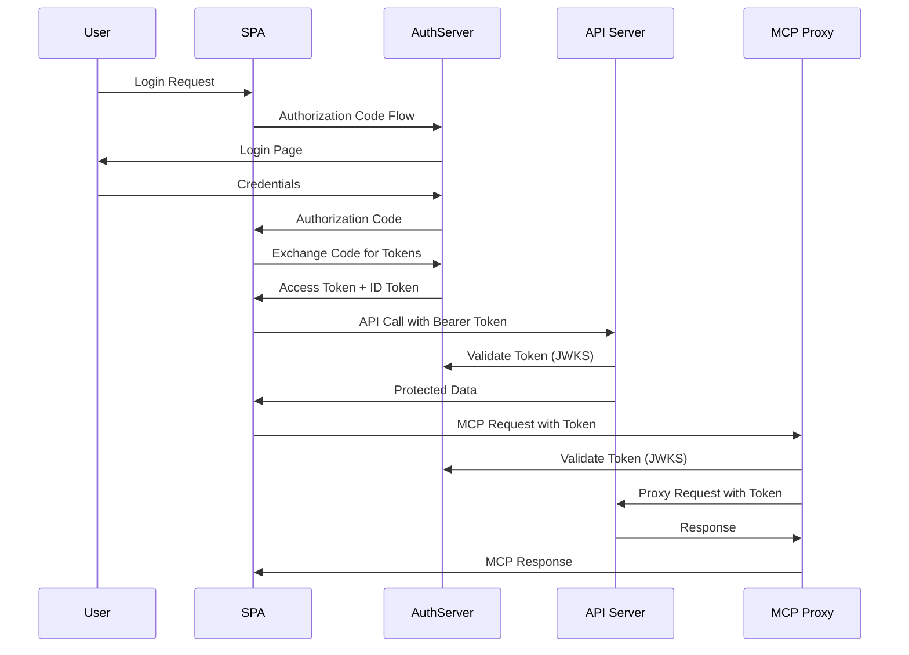

# MCP OAuth Authentication Project

A comprehensive OAuth 2.0 / OpenID Connect authentication system for Model Context Protocol (MCP) servers, featuring a secure distributed architecture with multiple services working together.

## 🏗️ Architecture Overview

This project demonstrates a complete authentication flow for MCP servers using OAuth 2.0 with the following components:

```
┌─────────────┐    ┌──────────────┐    ┌─────────────┐    ┌─────────────┐
│             │    │              │    │             │    │             │
│  React SPA  │◄──►│ AuthServer   │◄──►│    API      │◄──►│ MCP Proxy   │
│ (Frontend)  │    │ (OAuth/OIDC) │    │ (Resource)  │    │ (FastAPI)   │
│             │    │              │    │             │    │             │
└─────────────┘    └──────────────┘    └─────────────┘    └─────────────┘
  Port: 5173         Port: 5001         Port: 5000         Port: 8010
```

## 🚀 Components

### 1. **AuthServer** (ASP.NET Core + Duende IdentityServer)

- **Purpose**: OAuth 2.0 / OpenID Connect authorization server
- **Port**: 5001
- **Key Features**:
  - JWT token issuance and validation
  - User authentication and consent management
  - PKCE (Proof Key for Code Exchange) support
  - Configurable scopes: `openid`, `profile`, `email`, `api`, `weatherget`
  - Test user management for development

### 2. **API** (ASP.NET Core Web API)

- **Purpose**: Protected resource server with weather data endpoints
- **Port**: 5000
- **Key Features**:
  - JWT Bearer token authentication
  - Scope-based authorization (`weatherget` scope required)
  - Weather forecast controller with sample data
  - CORS configuration for cross-origin requests
  - Swagger/OpenAPI documentation

### 3. **SPA** (React + TypeScript + Vite)

- **Purpose**: Single Page Application frontend
- **Port**: 5173 (dev server)
- **Key Features**:
  - OIDC authentication flow using `oidc-client-ts`
  - Protected routes and JWT token management
  - Weather data display from protected API
  - Modern React with TypeScript and Vite build system

### 4. **MCPProxy** (FastAPI + Python)

- **Purpose**: Model Context Protocol server with OAuth authentication
- **Port**: 8010
- **Key Features**:
  - FastAPI-based MCP server using `fastapi-mcp` library
  - JWT token validation against JWKS endpoint
  - OAuth 2.0 integration with authorization code flow
  - Protected and public endpoints demonstration
  - Token-based API proxying to backend services

## 🔐 Authentication Flow



## 🛠️ Setup and Installation

### Prerequisites

- .NET 8.0 SDK
- Node.js 18+ and npm
- Python 3.12+
- Docker (optional)

### Quick Start with Docker

```bash
# Clone the repository
git clone <repository-url>
cd api-mcp-auth

# Start all services with Docker Compose
docker-compose up --build
```

### Manual Setup

#### 1. AuthServer Setup

```bash
cd AuthServer
dotnet restore
dotnet run
# Runs on http://localhost:5001
```

#### 2. API Setup

```bash
cd Api
dotnet restore
dotnet run
# Runs on http://localhost:5000
```

#### 3. SPA Setup

```bash
cd Spa
npm install
npm run dev
# Runs on http://localhost:5173
```

#### 4. MCP Proxy Setup

```bash
cd MCPProxy
# Install uv (modern Python package manager)
pip install uv
uv sync
uv run python fastapimcp_server_oauth.py
# Runs on http://localhost:8010
```

## 🔧 Configuration

### Environment Variables

| Service    | Variable          | Default                 | Description             |
| ---------- | ----------------- | ----------------------- | ----------------------- |
| MCPProxy   | `ISSUER_URL`      | `http://localhost:5001` | OAuth issuer URL        |
| MCPProxy   | `API_BASE_URL`    | `http://localhost:5000` | Backend API URL         |
| API        | `ASPNETCORE_URLS` | `http://+:5000`         | API binding URL         |
| AuthServer | `ASPNETCORE_URLS` | `http://+:5001`         | Auth server binding URL |

### OAuth Configuration

The system uses the following OAuth 2.0 configuration:

- **Client ID**: `interactive`
- **Grant Type**: Authorization Code with PKCE
- **Scopes**: `openid profile email api weatherget`
- **Redirect URIs**:
  - `http://localhost:5173/signin-oidc` (SPA)
  - `http://localhost:3334/oauth/callback` (MCP)

## 📁 Project Structure

```
api-mcp-auth/
├── AuthServer/              # OAuth/OIDC Authorization Server
│   ├── Config.cs           # OAuth clients, scopes, resources
│   ├── HostingExtensions.cs # Service configuration
│   ├── Pages/              # Identity UI pages
│   └── Program.cs          # Application entry point
├── Api/                    # Protected Resource API
│   ├── Controllers/        # API controllers
│   ├── Middleware/         # Custom middleware
│   ├── Startup.cs         # Service configuration
│   └── Program.cs         # Application entry point
├── Spa/                    # React Frontend
│   ├── src/
│   │   ├── auth.service.ts # OIDC client configuration
│   │   ├── App.tsx        # Main application component
│   │   └── weather.service.ts # API client
│   └── package.json       # Dependencies
├── MCPProxy/              # MCP Server with OAuth
│   ├── fastapimcp_server_oauth.py # Main MCP server
│   ├── shared/
│   │   ├── auth.py        # JWT validation utilities
│   │   └── setup.py       # Logging configuration
│   └── pyproject.toml     # Python dependencies
└── docker-compose.yml     # Container orchestration
```

## 🔍 API Endpoints

### AuthServer (Port 5001)

- `GET /.well-known/openid-configuration` - OIDC discovery document
- `GET /.well-known/openid-configuration/jwks` - JSON Web Key Set
- `POST /connect/authorize` - Authorization endpoint
- `POST /connect/token` - Token endpoint

### API (Port 5000)

- `GET /WeatherForecast` - Protected weather data (requires `weatherget` scope)
- `GET /swagger` - API documentation

### SPA (Port 5173)

- `/` - Main application
- `/signin-oidc` - OIDC callback
- `/signout-callback-oidc` - Logout callback

### MCP Proxy (Port 8010)

- `GET /api/public` - Public endpoint
- `GET /api/protected` - Protected endpoint (requires authentication)
- `GET /api/sample` - Weather data proxy (requires token)

## 🧪 Testing

### Test User Credentials

The AuthServer includes test users for development:

- **Username**: `alice` / **Password**: `alice`
- **Username**: `bob` / **Password**: `bob`

### Testing Flow

1. Navigate to `http://localhost:5173`
2. Click "Login" to start OAuth flow
3. Enter test credentials on AuthServer
4. Grant consent for requested scopes
5. View weather data from protected API
6. Check browser console for JWT token details

## 🐳 Docker Support

Each service includes a Dockerfile for containerization:

```bash
# Build and run individual services
docker build -t auth-server -f AuthServer/Dockerfile .
docker build -t api-server -f Api/Dockerfile .
docker build -t spa-client -f Spa/Dockerfile .
docker build -t mcp-proxy -f MCPProxy/Dockerfile .

# Or use docker-compose for all services
docker-compose up --build
```

## 🔒 Security Features

- **PKCE (Proof Key for Code Exchange)** for secure authorization code flow
- **JWT Bearer tokens** with RSA256 signature validation
- **JWKS (JSON Web Key Set)** for key rotation support
- **Scope-based authorization** for fine-grained access control
- **CORS configuration** for secure cross-origin requests
- **HTTPS redirect** in production configurations

## 🚀 MCP Integration

The MCP Proxy demonstrates how to integrate OAuth 2.0 authentication with Model Context Protocol servers:

1. **OAuth Configuration**: Uses `fastapi-mcp` with `AuthConfig` for seamless OAuth integration
2. **Token Validation**: Validates JWT tokens against the JWKS endpoint
3. **Dependency Injection**: Uses FastAPI's dependency system for token validation
4. **API Proxying**: Forwards authenticated requests to backend services

## 🛠️ Development

### Adding New Scopes

1. Add scope to `AuthServer/Config.cs` in `ApiScopes`
2. Include scope in client configuration
3. Update API authorization policies
4. Update SPA scope requests

### Extending MCP Endpoints

1. Add new FastAPI endpoints in `fastapimcp_server_oauth.py`
2. Use dependency injection for authentication
3. Add appropriate `operation_id` for MCP registration

## 📝 License

This project is for educational and demonstration purposes. Check individual component licenses for production use.

## 🤝 Contributing

1. Fork the repository
2. Create a feature branch
3. Make your changes
4. Test all services
5. Submit a pull request

## 📚 References

- [Duende IdentityServer Documentation](https://docs.duendesoftware.com/identityserver)
- [Model Context Protocol Specification](https://modelcontextprotocol.io/)
- [FastAPI MCP Library](https://github.com/pydantic/fastapi-mcp)
- [OIDC Client TS](https://github.com/authts/oidc-client-ts)
- [OAuth 2.0 RFC](https://tools.ietf.org/html/rfc6749)
